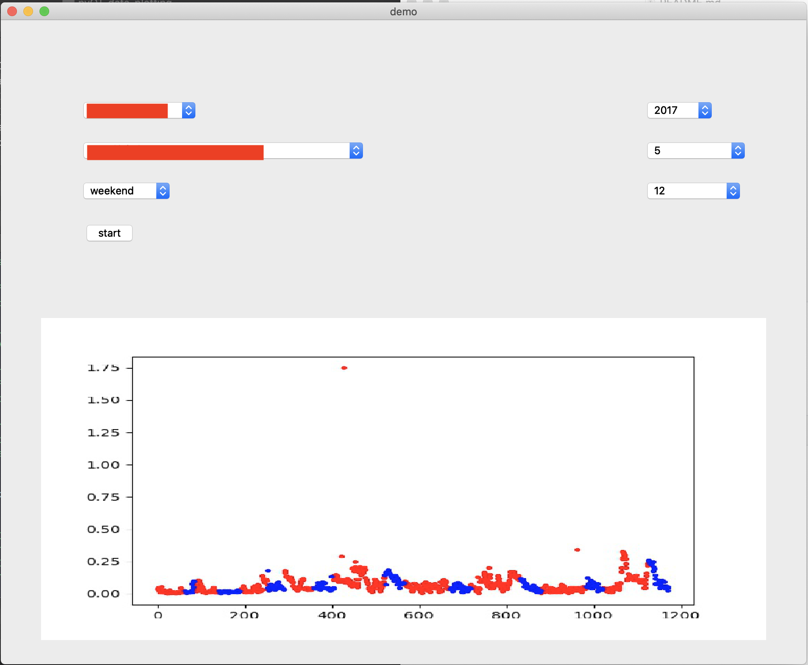
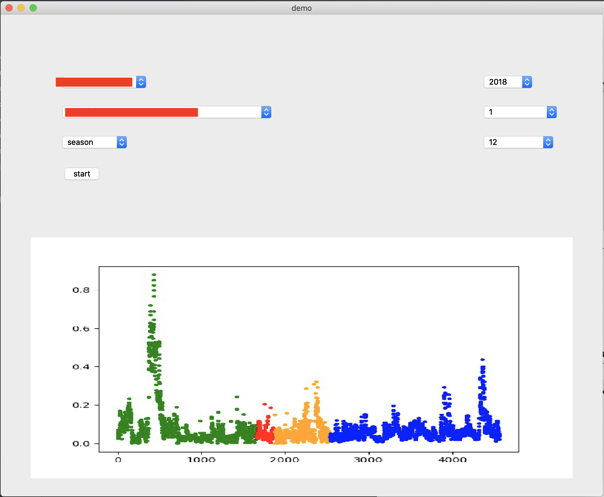

# pyQT_data_plotting

This program aims to plot scatter chart from large data( e.g 100MB+ ).

#### This program is under the instruction of Prof.  Xuekun FANG


## How does it work

* Front end: QT 
* Back end: python 3.8


## How to start

### :1st_place_medal:For WSL

#### Step1 Set up your environment

You'd better install WLS

Here is the tutorial on how to install WLS in windows:[WSL 使用指南——02 安装配置](https://zhuanlan.zhihu.com/p/34885182)

After you have finished, you can use Windows just like Linux.


#### Step2 Install anaconda

[两行代码下载安装Anaconda（linux环境）](https://blog.csdn.net/lwgkzl/article/details/89329383)

After you have set up **anaconda** environment, things will be easy and clear.:1st_place_medal:

use this command to check if anaconda is installed correctly.

```shell
conda -V
```

If the output is :


Congratulations!

For more infomation about anaconda, you can search google or visit their [office site](https://www.anaconda.com)


* Intall chinese_calendar:

```
pip install chinesecalendar
```


For **windows**, you need install some package:

* Install XMING:[windows上安装XMING](https://sourceforge.net/projects/xming/)
* Type the following cmd:

```
export DISPLAY=:0
```


#### Step3 Check your data file and code files

* download code with git clone:

```
git clone -b branch_name git_link
```

where **branch_name** denotes branch name; git_link denotes the link on Github.

* **or**  download code directly:


Then, you should place your **data file** in right place.

Actually, you can place data file in any place, if you remember to change the file path code in `get_img.py`.

**In this program**, you can just put `pyQT_data` file in the same direction.


The structure of this program is as follows:

```
.
├── pyQT_data
├── pyQT_data_plotting
    ├── LICENSE
    ├── README.assets
    │   ├── Screen\ Shot\ 2020-11-24\ at\ 01.01.34.png
    │   └── Screen\ Shot\ 2020-11-24\ at\ 01.13.02.png
    ├── README.md
    ├── main.py
    ├── resources
    │   └── img
    └── src
        ├── __pycache__
        │   ├── get_img.cpython-37.pyc
        │   └── get_img.cpython-38.pyc
        └── get_img.py
```


#### Step4 Run and enjoy :P

In `pyQT_data_plotting` file , type

```shell
python main.py
```

to start QT.


### :1st_place_medal:For MacOS / Linux

Follow **Step2 ~ Step4** above


### :1st_place_medal:For Windows

#### Step1 Download python 

[Windows下Python的安装与使用](https://blog.csdn.net/Wang_Jiankun/article/details/80565719)

#### Step2 open cmd 

Type **Window** key and type in `cmd`, you will find it.


#### Follow Step3 ~ Step4 above. 

(you may encounter some problems, using `pip install ` can solve them)


**There are three modes in total:**

* Weekend mode :

red dot for `weekday`

blue dot for `weekend`




* Day_night mode:

green dot for `night time` 

black dot for `night time`


* season mode

Green dot for `spring`

Red dot for `summer`

Orange  dot for `fall`

Blue dot for `winter`




